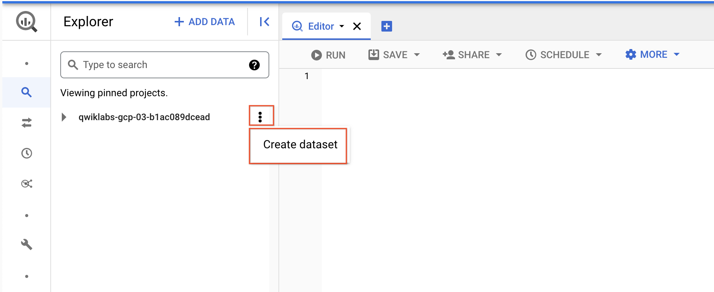
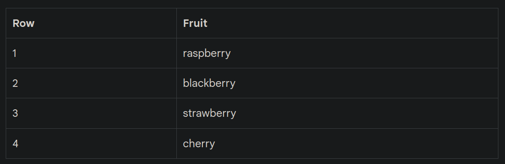
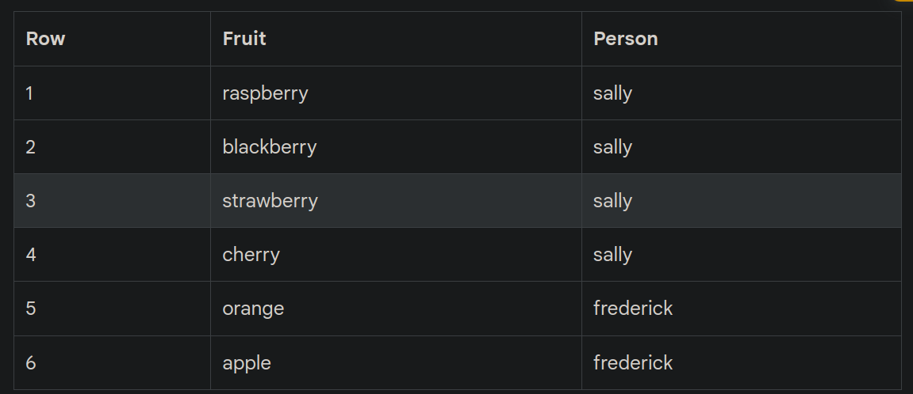
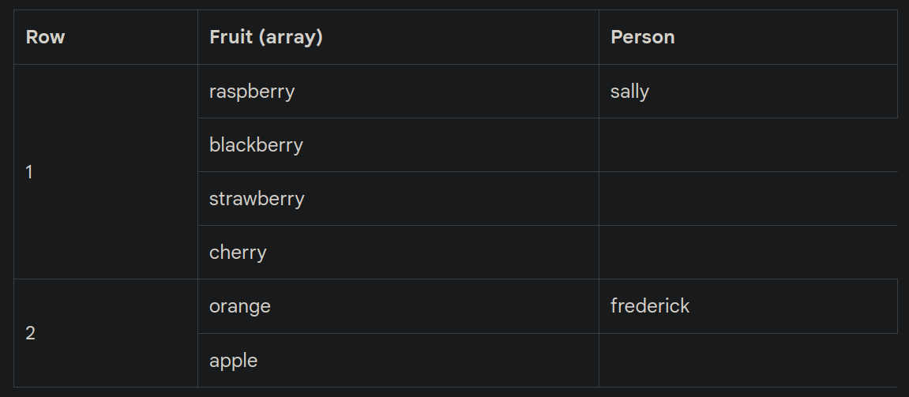
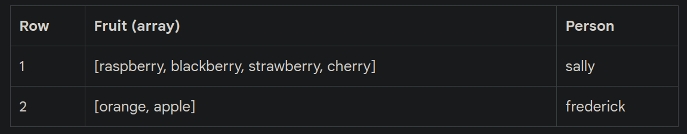
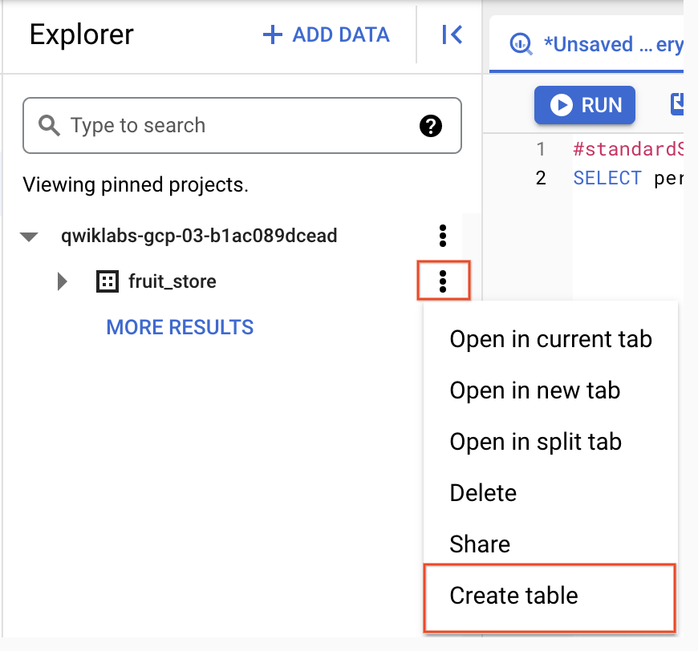

## Overview

[BigQuery](https://cloud.google.com/bigquery) is Google's fully managed, NoOps, low cost analytics database. With BigQuery you can query terabytes and terabytes of data without having any infrastructure to manage or needing a database administrator. BigQuery uses SQL and can take advantage of the pay-as-you-go model. BigQuery allows you to focus on analyzing data to find meaningful insights.

This lab is an in-depth walkthrough of working with semi-structured data (ingesting JSON, Array data types) inside of BigQuery. Denormalizing your schema into a single table with nested and repeated fields can yield performance improvements, but the SQL syntax for working with array data can be tricky. You will practice loading, querying, troubleshooting, and unnesting various semi-structured datasets.

### Objectives

In this lab, you learn about the following:

* Loading semi-structured JSON into BigQuery
* Creating and querying arrays
* Creating and querying structs
* Querying nested and repeated fields
 

## Set up and requirements

1. Create GCP project (if not already created)
2. Click Open Google Console.

### Open BigQuery Console
1. In the Google Cloud Console, select **Navigation menu** > **BigQuery**.

The **Welcome to BigQuery in the Cloud Console** message box opens. This message box provides a link to the quickstart guide and lists UI updates.

2. Click **Done**.

## Task 1. Create a new dataset to store our tables

1. To create a dataset, click on the **View actions** icon next to your Project ID and then select **Create dataset**.


2. Name the new dataset **fruit_store**. Leave the other options at their default values (Data Location, Default Table Expiration).

3. Click **Create dataset**.


## Task 2. Practice working with Arrays in SQL

Normally in SQL you will have a single value for each row like this list of fruits below:


What if you wanted a list of fruit items for each person at the store? It could look something like this:


In traditional relational database SQL, you would look at the repetition of names and immediately think to split the above table into two separate tables: Fruit Items and People. That process is called [normalization](https://en.wikipedia.org/wiki/Database_normalization) (going from one table to many). This is a common approach for transactional databases like mySQL.

For data warehousing, data analysts often go the reverse direction (denormalization) and bring many separate tables into one large reporting table.

Now, you're going to learn a different approach that stores data at different levels of granularity all in one table using repeated fields:


What looks strange about the previous table?

* It's only two rows.
* There are multiple field values for Fruit in a single row.
* The people are associated with all of the field values.

What's the key insight? The `array` data type!

An easier way to interpret the Fruit array:


Both of these tables are exactly the same. There are two key learnings here:

* An array is simply a list of items in brackets [ ]
* BigQuery visually displays arrays as *flattened*. It simply lists the value in the array vertically (note that all of those values still belong to a single row)

### Try it yourself.

1. Enter the following in the BigQuery Query Editor:
```
#standardSQL
SELECT
['raspberry', 'blackberry', 'strawberry', 'cherry'] AS fruit_array
```

2. Click **Run**

Arrays can only share one data type (all strings, all numbers).

3. Here's the final table to query against:
```
#standardSQL
SELECT person, fruit_array, total_cost FROM `data-to-insights.advanced.fruit_store`;
```

5. Click **Run**

6. After viewing the results, click the **JSON** tab to view the nested structure of the results.

### Loading semi-structured JSON into BigQuery

What if you had a JSON file that you needed to ingest into BigQuery?

1. Create a new table in the `fruit_store` dataset.

2. To create a table, click on the **View actions** icon next to the `fruit_store` dataset and select **Create Table**.


3. Add the following details for the table:

* **Source**: Choose **Google Cloud Storage** in the **Create table from** dropdown.
* **Select** file from **GCS bucket** (type or paste the following): data-insights-course/labs/optimizing-for-performance/shopping_cart.json
* **File format:** JSONL (Newline delimited JSON) {This will be auto-populated}
* **Schema:** Check **Auto detect** (Schema and input parameters).

4. Call the new table "fruit_details".

5. Click **Create table**.

In the schema, note that `fruit_array` is marked as REPEATED which means it's an array.

**Recap**

* BigQuery natively supports arrays
* Array values must share a data type
* Arrays are called REPEATED fields in BigQuery


## Task 3. Creating your own arrays with ARRAY_AGG()

Don't have arrays in your tables already? You can create them!

1. **Copy and Paste** the below query to explore this public dataset:
```
SELECT
  fullVisitorId,
  date,
  v2ProductName,
  pageTitle
  FROM `data-to-insights.ecommerce.all_sessions`
WHERE visitId = 1501570398
ORDER BY date
```
2. Click Run and view the results.

3. Now, we will use the `ARRAY_AGG()` function to aggregate our string values into an array. Copy and paste the below query to explore this public dataset:
```
SELECT
  fullVisitorId,
  date,
  ARRAY_AGG(v2ProductName) AS products_viewed,
  ARRAY_AGG(pageTitle) AS pages_viewed
  FROM `data-to-insights.ecommerce.all_sessions`
WHERE visitId = 1501570398
GROUP BY fullVisitorId, date
ORDER BY date
```

4. Click **Run** and view the results.

5. Next, we will use the `ARRAY_LENGTH()` function to count the number of pages and products that were viewed:
```
SELECT
  fullVisitorId,
  date,
  ARRAY_AGG(v2ProductName) AS products_viewed,
  ARRAY_LENGTH(ARRAY_AGG(v2ProductName)) AS num_products_viewed,
  ARRAY_AGG(pageTitle) AS pages_viewed,
  ARRAY_LENGTH(ARRAY_AGG(pageTitle)) AS num_pages_viewed
  FROM `data-to-insights.ecommerce.all_sessions`
WHERE visitId = 1501570398
GROUP BY fullVisitorId, date
ORDER BY date
```

6. Next, let's deduplicate the pages and products so we can see how many unique products were viewed. We'll simply add `DISTINCT` to our `ARRAY_AGG()`:
```
SELECT
  fullVisitorId,
  date,
  ARRAY_AGG(DISTINCT v2ProductName) AS products_viewed,
  ARRAY_LENGTH(ARRAY_AGG(DISTINCT v2ProductName)) AS distinct_products_viewed,
  ARRAY_AGG(DISTINCT pageTitle) AS pages_viewed,
  ARRAY_LENGTH(ARRAY_AGG(DISTINCT pageTitle)) AS distinct_pages_viewed
  FROM `data-to-insights.ecommerce.all_sessions`
WHERE visitId = 1501570398
GROUP BY fullVisitorId, date
ORDER BY date
```

**Recap**

You can do some pretty useful things with arrays like:

Finding the number of elements with `ARRAY_LENGTH(<array>)`
Deduplicating elements with `ARRAY_AGG(DISTINCT <field>)`
Ordering elements with `ARRAY_AGG(<field> ORDER BY <field>)`
Limiting `ARRAY_AGG(<field> LIMIT 5)`


## Task 4. Querying datasets that already have ARRAYs

The BigQuery Public Dataset for Google Analytics `bigquery-public-data.google_analytics_sample` has many more fields and rows than our course dataset `data-to-insights.ecommerce.all_sessions`. More importantly, it already stores field values like products, pages, and transactions natively as ARRAYs.

1. **Copy and Paste** the below query to explore the available data and see if you can find fields with repeated values (arrays):
```
SELECT
  *
FROM `bigquery-public-data.google_analytics_sample.ga_sessions_20170801`
WHERE visitId = 1501570398
```

2. **Run** the query.

3. **Scroll right** in the results until you see the hits.`product.v2ProductName` field (we will discuss the multiple field aliases shortly).

4. The amount of fields available in the Google Analytics schema can be overwhelming for our analysis. Let's try to query just the visit and page name fields like we did before:
```
SELECT
  visitId,
  hits.page.pageTitle
FROM `bigquery-public-data.google_analytics_sample.ga_sessions_20170801`
WHERE visitId = 1501570398
```

You will get an error: `Cannot access field product on a value with type ARRAY> at [5:8]`

Before we can query REPEATED fields (arrays) normally, you must first break the arrays back into rows.

For example, the array for `hits.page.pageTitle` is stored currently as a single row like:

`['homepage','product page','checkout']`

and we need it to be:

```
['homepage',
'product page',
'checkout']
```

How do we do that with SQL?

Answer: Use the `UNNEST()` function on your array field:
```
SELECT DISTINCT
  visitId,
  h.page.pageTitle
FROM `bigquery-public-data.google_analytics_sample.ga_sessions_20170801`,
UNNEST(hits) AS h
WHERE visitId = 1501570398
LIMIT 10
```

We'll cover UNNEST() more in detail later but for now just know that:

* You need to UNNEST() arrays to bring the array elements back into rows
* UNNEST() always follows the table name in your FROM clause (think of it conceptually like a pre-joined table)


## Task 5. Introduction to STRUCTs

You may have wondered why the field alias `hit.page.pageTitle` looks like three fields in one separated by periods. Just as ARRAY values give you the flexibility to go deep into the granularity of your fields, another data type allows you to go wide in your schema by grouping related fields together. That SQL data type is the [STRUCT](https://cloud.google.com/bigquery/docs/reference/standard-sql/data-types#struct-type) data type.

The easiest way to think about a STRUCT is to consider it conceptually like a separate table that is already pre-joined into your main table.

A STRUCT can have:

* One or many fields in it
* The same or different data types for each field
* Its own alias

Sounds just like a table right?

### Let's explore a dataset with STRUCTs

1. Under **Explorer** find the **bigquery-public-data** dataset.

2. If it's not present already, click **ADD > Star a project by name**.

3. Click **Enter project name.**

4. Enter `bigquery-public-data` and click **Star.**

5. Click `bigquery-public-data` in the pinned project list to expand it.

6. Find and open **google_analytics_sample.**

7. Click the **ga_sessions** table.

8. Start scrolling through the schema and review

9. As you can imagine, there is an incredible amount of website session data stored for a modern ecommerce website. The main advantage of having 32 STRUCTs in a single table is it allows you to run queries like this one without having to do any JOINs:
```
SELECT
  visitId,
  totals.*,
  device.*
FROM `bigquery-public-data.google_analytics_sample.ga_sessions_20170801`
WHERE visitId = 1501570398
LIMIT 10
```

```Note: The `.*` syntax tells BigQuery to return all fields for that STRUCT (much like it would if totals.* was a separate table we joined against).```

Storing your large reporting tables as STRUCTs (pre-joined "tables") and ARRAYs (deep granularity) allows you to:

* Gain significant performance advantages by avoiding 32 table JOINs
* Get granular data from ARRAYs when you need it but not be punished if you don't (BigQuery stores each column individually on disk)
* Have all the business context in one table as opposed to worrying about JOIN keys and which tables have the data you need


<!-- ## Task 6. Practice with STRUCTs and ARRAYs

The next dataset will be lap times of runners around the track. Each lap will be called a "split".
 -->